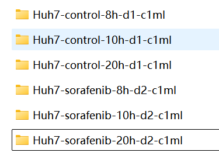
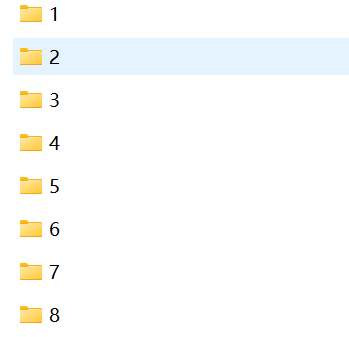
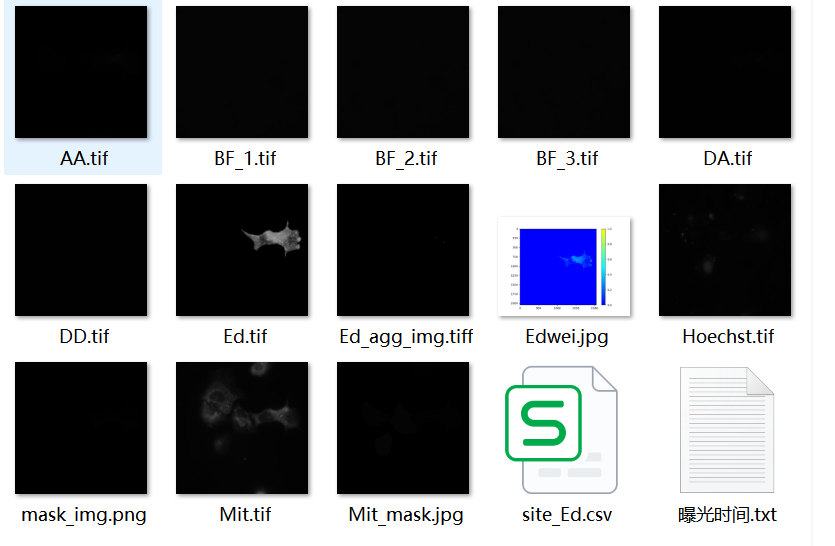
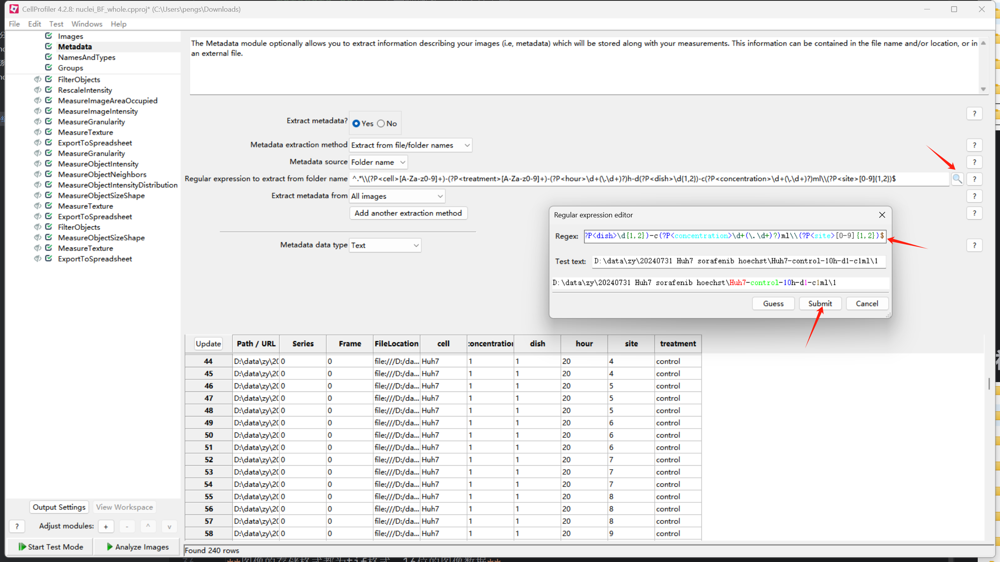

# 输入图像数据命名规范

## 1.实验干扰组命名


* 如上图所示，干扰组文件夹命名名称 `{Metadata_cell}-{Metadata_treatment}-{Metadata_hour}-d{Metadata_dish}-c{Metadata_concentration}μm`，其中各自定义如下
    - `Metadata_cell` 表示细胞系，用字符表示
    - `Metadata_treatment` 表示实验组干扰，用字符表示
    - `Metadata_hour` 表示实验时间，用数字表示
    - `Metadata_dish` 表示不同皿，用数字表示
    - `Metadata_concentration` 表示对应的浓度，默认单位是`μm`
## 2.视野site命名


* 如上图所示，在干扰组文件夹下，按照数字组成不同视野的图像集，名称为 `{Metadata_site}` ，值必须为整数数字类型。

## 3.图像文件命名


* 如上图所示，图像命名需要符合一定规范。在不同视野的图像集下，可以存在不同类型的图像，可以是
    - `DD、DA、AA` FRET三通道图像
    - `Mit` 线粒体图像
    - `BF_1` 明场图像，后面数字表示可以拍摄多张图像，如`BF_2`、`BF_3`
    - `Hoechst` 细胞核图像

**图像的存储格式都为tif格式，16位的图像数据**

## 4. 正则匹配公式
可以用于CellProfiler或者Python程序进行数据读取，所有参数需要添加前缀 `Metadata_`，如`Metadata_cell`。
具体正则匹配公式如下：
```cmd
^.*\\(?P<cell>[A-Za-z0-9]+)-(?P<treatment>[A-Za-z0-9]+)-(?P<hour>\d+(\.\d+)?)h-d(?P<dish>\d{1,2})-c(?P<concentration>\d+(\.\d+)?)μm\\(?P<site>[0-9]{1,2})$
```

## 5. 代码展示
## 5.1 Cellprofiler 匹配


具体流程为：

* 点击启用元数据记录
* 添加正则匹配规则
* 提交submit

